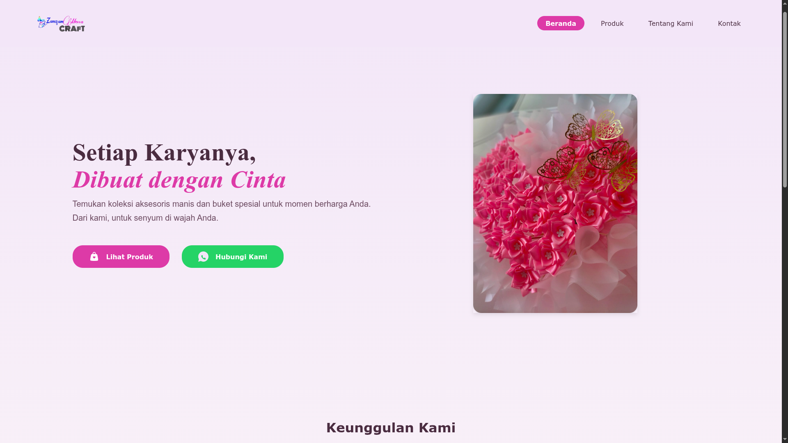
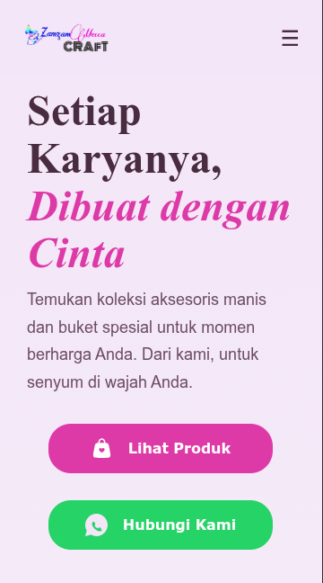
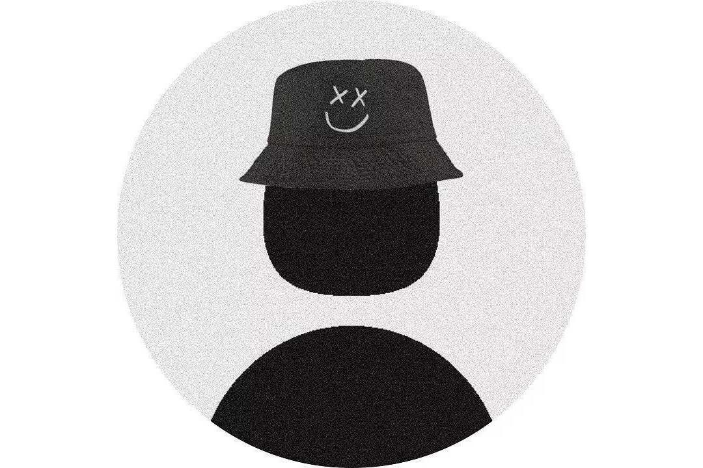

# ZamzamMecca CRAFT

<div align="center">

# 🌸 ZamzamMecca CRAFT


<br><br>

<p>
  <i>
    Platform website bisnis ZamzamMecca CRAFT yang menghadirkan koleksi aksesoris handmade dan buket spesial dengan tampilan modern, elegan, dan responsif.
  </i>
</p>

🌐 <strong>Live Demo:</strong><br>
<a href="https://yuzikakal.github.io/DesignWeb" target="_blank">
  yuzikakal.github.io/DesignWeb
</a>

</div>

---

## 📱 Preview Website

<div align="center">

<table>
<tr>
<td align="center" width="50%">

### Desktop View


</td>

<td align="center" width="50%">

### Mobile View


</td>
</tr>
</table>

</div>

---

## 🌟 Fitur Utama

- 🎨 **Katalog Interaktif**  
  Menampilkan berbagai produk handmade dan buket pilihan dengan desain modern dan user-friendly.

- 🖼️ **Auto Slider Header**  
  Slider otomatis pada halaman utama untuk menampilkan produk unggulan secara dinamis.

- 💬 **Integrasi WhatsApp**  
  Memudahkan pelanggan melakukan konsultasi dan pemesanan langsung melalui WhatsApp.

- 📱 **Responsive Design**  
  Tampilan website telah dioptimalkan untuk berbagai ukuran layar, baik desktop maupun mobile.

- ⚡ **Fast & Lightweight**  
  Dibangun menggunakan HTML, CSS, dan JavaScript murni sehingga website ringan dan cepat diakses.

---

## 🛠️ Dibangun Dengan

| Teknologi | Fungsi |
| :--- | :--- |
|  | Struktur utama website |
|  | Styling, layout, animasi, dan responsive design |
|  | Interaktivitas website dan logika slider |

---

# 👥 Tim Pengembang

<table align="center">
  <tr>
    <td align="center" width="150px">
      
    </td>
    <td>
      <strong>Yuzika</strong> <br>
      <i>Lead Developer & Designer</i> <br><br>
      <a href="https://github.com/yuzikakal" target="_blank"></a>
      <a href="https://yuzika5.wordpress.com" target="_blank"></a>
      <a href="https://www.facebook.com/yuzikakal2" target="_blank"></a>
      <a href="https://www.instagram.com/yuzika_kalzamzami" target="_blank"></a>
    </td>
  </tr>
  
  <tr>
    <td align="center" width="150px">
      
    </td>
    <td>
      <strong>Fauzan Fadhil</strong> <br>
      <i>UI/UX & Concept Partner</i> <br><br>
      <a href="https://github.com/fauzanketche" target="_blank"></a>
      <a href="https://discord.com/users/955846335293190154" target="_blank"></a>
      <a href="https://www.instagram.com/fauzanfdhil_" target="_blank"></a>
    </td>
  </tr>
  
  <tr>
    <td align="center" width="150px">
      
    </td>
    <td>
      <strong>Sarhan</strong> <br>
      <i>QA Tester</i> <br><br>
      <a href="https://www.instagram.com/s.alzamm" target="_blank"></a>
    </td>
  </tr>
</table>

---

# 📂 Struktur Proyek

Struktur folder proyek dibuat sederhana agar mudah dipahami dan dikembangkan kembali.

```text
zamzammecca-craft/
│
├── index.html
│
├── css/
│   └── style.css
│
├── js/
│   ├── data.js
|   └── main.js
│
├── public/
│   │
│   ├── fonts/
│   ├── icons/
│   └── img/
│
└── README.md
```
---

# 🚀 Cara Menjalankan Project

1. Clone repository

```bash
git clone https://github.com/yuzikakal/DesignWeb.git
```

2. Masuk ke folder project

```bash
cd DesignWeb
```

3. Jalankan menggunakan browser

```bash
Buka file index.html
```

---

# 📌 Catatan

* Website ini bersifat statis dan tidak memerlukan backend.
* Seluruh fitur berjalan menggunakan JavaScript murni.
* Cocok digunakan sebagai landing page bisnis handmade dan bouquet store.

---

<div align="center">

### ✨ ZamzamMecca CRAFT ✨

Made with ❤️ by ZamzamMecca Team

</div>

